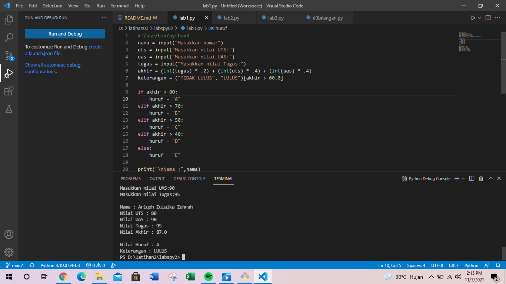
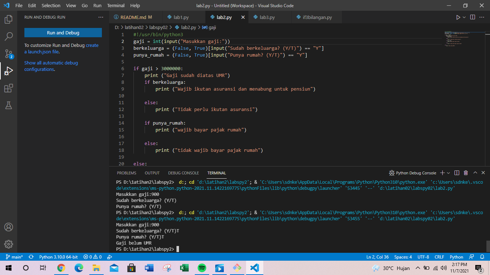
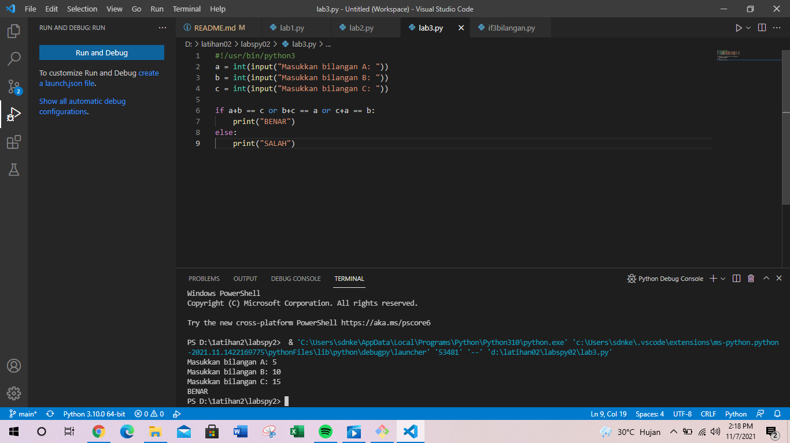
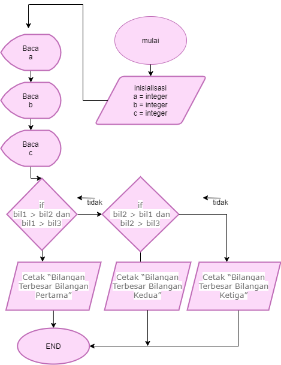
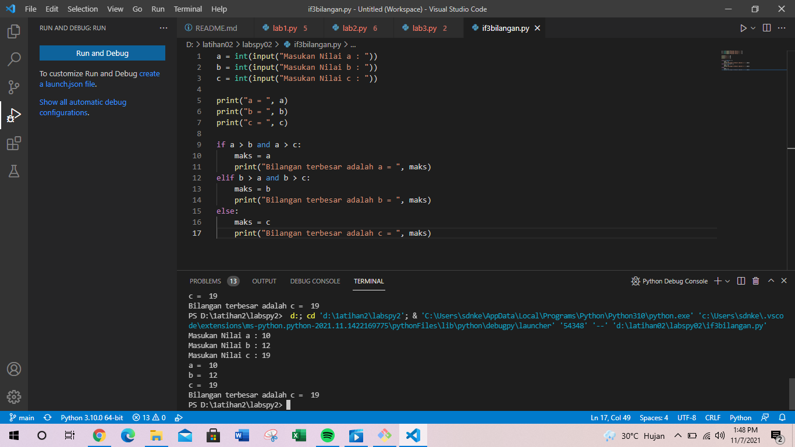

# labspy02
## latihan modul praktikum 2
### berikut program nya
    NAMA    :Ariqoh Zulaika Zuhrah
    KELAS   :TI.21.A1
    NIM     :312110138
    MATKUL  :Bahasa Pemogram
Pertama,Buka Visual Studio Code di PC/Laptop
Klik (File > New File) untuk Membuat File Baru
Isi file tersebut dengan Program kalian, Disini saya membuat Program lab1.py
Setelah itu Save Program kalian dengan klik (File > Save) atau tekan (CTRL + S)
Membuat folder baru dan berikan nama file tersebut dengan lab1.py
Klik (Run > Run Module) untuk menjalankan Programnya
program sederhana dengan Membuat program menentukan nilai akhir.

Pertama,Buat program sederhada dengan Membuat program menampilkan status gaji karyawan.
Klik (File > New File) Untuk Membuat File Baru
Isi File tersebut dengan program kalian,Disini saya membuat program lab2.py
Setelah itu Save program kalian klik (File > Save) atau tekan (CTRL + S)
Membuat folder baru berikan nama file tersebut dengan lab2.py
Klik (Run > Run Module) untuk menjalankan programnya 
Program sederhana dengan Membuat program menampilkan status gaji karyawan.

Pertama,Buka Visuak Studio Code di PC/Laptop
Klik (File > New File) Untuk Membuat File Baru
Isi file tersebut dengan Program kalian, Disini saya membuat Program lab3.py
Setelah itu Save Program kalian dengan klik (File > Save) atau tekan (CTRL + S)
Membuat folder baru dan berikan nama file tersebut dengan lab3.py
Klik (Run > Run Module) untuk menjalankan Programnya
program sederhana dengan Membuat program penggunaan kondisi OR.

Algoritma Program
Diketahui 3 buah bilangan bil1,bil2,bil3, akan dicari nilai yang terbesar.

1.Mulai
2..Inisiasi bil1,bil2,bil3 sebagai integer.
3.Baca bil1.
4.Baca bil2.
5.Baca bil3.
6.Jika bil1 > bil2 dan bil1 > bil3 maka
7.kerjakan langkah 8, selain itu
8.Jika bil2 > bil1 dan bil2 > bil3 maka
9.kerjakan langkah 9, selain itu kerjakan langkah 10.
10.Cetak “Bilangan Terbesar Bilangan Pertama”.
11.Cetak “Bilangan Terbesar Bilangan Kedua”.
12.Cetak “Bilangan Terbesar Bilangan Ketiga”.
13.Selesai

